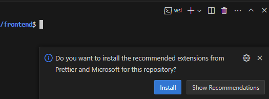

# Configuração de ambiente
## Execução do projeto

### Ferramentas necessárias

> Para executar o projeto, é necessário possuir as seguintes ferramentas:
> 
- [Git](https://git-scm.com/)
- [Node.js 18.13.0](https://nodejs.org/en/)
- Editor de código sugerido: [Visual Studio Code](https://code.visualstudio.com/) (VS Code)

> Após a instalação de todas as ferramentas acima, prossiga: 

#### Clone o repositório via HTTPS:

```
git clone https://gitlab.ifrn.edu.br/pnp/pnp-frontend.git
```

#### Clone o repositório via SSH:

```
git clone git@gitlab.ifrn.edu.br:pnp/pnp-frontend.git
```

#### Acesse o diretório gerado:

```
cd pnp-frontend/frontend
```

#### Instale o gerenciador de pacotes Yarn:

```
npm install --global yarn@1.22.19
```

#### Instale as dependências do projeto:

```
yarn
```

#### Execute o projeto:

```
yarn dev
```

## Configuração de variáveis de ambiente

- Na raiz do diretório *frontend*, crie um arquivo chamado `.env`.
- Adicione as seguintes variáveis de ambiente:

```
VITE_API_URL=https://devbackend.pnp.ifrn.edu.br/api/v1
VITE_DJANGO_LOGIN_ENABLED=1
VITE_OAUTH2_LOGIN_ENABLED=0
```

- Para a variável `VITE_API_URL` é atribuída à rota base da API da PNP, que será utilizada nas requisições.

```
VITE_API_URL=https://devbackend.pnp.ifrn.edu.br/api/v1
```

> As variáveis de ambiente `VITE_DJANGO_LOGIN_ENABLED` e `VITE_OAUTH2_LOGIN_ENABLED` estão diretamente relacionadas aos cenários de login. Estas variáveis operam com valores `0` e `1`.
> 

- A variável de ambiente `VITE_DJANGO_LOGIN_ENABLED` serve para habilitar o cenário de login com usuário e senha, o qual é utilizado para o desenvolvimento do sistema. Para que isso ocorra, atribua o valor `1` a esta variável.

```
VITE_DJANGO_LOGIN_ENABLED=1
```

- A variável de ambiente `VITE_OAUTH2_LOGIN_ENABLED` serve para habilitar o cenário de login com o [GOV.BR](http://GOV.BR) . Para que isso ocorra, atribua o valor `1` a esta variável.

```
VITE_OAUTH2_LOGIN_ENABLED=1
```

> Caso ambas as variáveis de ambiente relacionadas aos cenários de login estejam habilitadas, será possível alternar entre os cenários mencionados, possibilitando a autenticação tanto com usuário e senha quanto com o [GOV.BR](https://www.gov.br/pt-br).
> 

## Configuração do Prettier e Eslint

> Para garantir o funcionamento adequado das configurações de análise estática e estilo de código no projeto, é essencial que a pasta *frontend*, contida dentro do repositório clonado, seja aberta diretamente no editor de código *Visual Studio Code (VS Code)*. Se por acaso uma pasta de nível superior for aberta - isto é, a pasta na qual o repositório foi clonado, **as configurações não serão aplicadas corretamente**.
> 
- Com o repositório frontend aberto conforme indicado acima, o VS Code apresentará um aviso questionando se você deseja instalar as extensões recomendadas que estão presentes no arquivo `.vscode/extensions.json`.   

<br>

- Aceite a instalação e automaticamente as extensões do `Eslint` e `Prettier` serão adicionadas. Isso é suficiente para que o *Eslint* e o *Prettier* funcionem no projeto.   



## Configuração do Prettier e Eslint manualmente

Caso o VS Code não apresente a mensagem de recomendação, realize os seguintes passos para realizar a configuração do `Eslint` e do `Prettier`:

> Configuração do `Eslint`:
> 
- No editor de código VS Code, instale a extensão **ESLint v2.4.4 (dbaeumer.vscode-eslint):**


- Após a instalação desta extensão, o ESLint estará ativo no projeto, identificando possíveis melhorias, prevenindo bugs e aprimorando a segurança. Essas ações são baseadas nas configurações definidas no arquivo `.eslintrc.json`.

> Configuração do `Prettier`:
> 
- No editor de código VS Code, instale a extensão **Prettier - Code formatter v10.1.0 (esbenp.prettier-vscode):**


- Após instalada esta extensão, sempre que um arquivo for salvo, ele será formatado automaticamente conforme as configurações do arquivo `.prettierrc`.

# Outros Scripts

## Execução do lint

> A execução do *lint* no projeto é essencial para identificar pontos de melhorias a fim de evitar possível *bugs* e falhas de segurança.
> 

#### **Execute o comando abaixo:**

> Este comando deve ser executado via terminal dentro do diretório *frontend*.
> 

```
yarn lint
```

- Ao executar este comando, o lint retornará, via terminal, sugestões de melhorias no código, avisos de falhas etc.

## Criação de componente e documentação via terminal

> Recomenda-se seguir o fluxo abaixo para a criação e documentação de componentes, pois este processo não apenas facilita a criação do componente, mas também otimiza o tempo de desenvolvimento.
> 

#### Execute o comando:

```
yarn run generate
```

#### Selecione a opção desejada:

```
? [PLOP] Please choose a generator. (Use arrow keys)
> component - criação de componente
  story - criação de story
```
<br>

**→ Components**

> Se você deseja criar um componente com documentação, por favor, selecione a opção `component`.
> 

#### Informe o nome do componente:

> Deve-se utilizar o prefixo `Br` + o nome do componente em `PascalCase`. Para mais detalhes, leia as diretivas do guia de [padrões de implementação](./padroes-desenvolvimento.md#nomenclatura_componentes) da PNP.
> 

Exemplo:

```
? Nome do novo componente?  BrCard
```

- Os passos mencionados acima criam uma pasta dentro do diretório global `components`. Esta pasta será nomeada de acordo com o nome do componente fornecido. Dentro desta pasta, serão gerados dois arquivos: `index.tsx` e `<NomeComponente>.stories.tsx`.
<br>
- Após a implementação do componente, deve-se utilizar o Storybook para sua documentação. Faça isso utilizando o arquivo `<NomeComponente>.stories.tsx`, seguindo a [documentação do Storybook](https://storybook.js.org/docs/react/writing-stories/introduction).
<br>

**→ Story** 

> Se você deseja criar um arquivo de documentação para um componente já existente, por favor, selecione a opção `Story`.
> 

#### Informe o nome do componente:

> Informe o nome do componente para o qual você deseja criar um documento do `Storybook`. Se fornecido um nome que não existe atualmente no diretório `components`, um novo diretório será criado com o nome informado, contendo um único arquivo: `<NomeDoComponente>.stories.tsx.`
> 

Exemplo:

```
? Nome do componente? BrCard
```

## Geração da build do projeto

> A build do projeto é feita para criar uma versão de produção otimizada.
> 

#### Comando para gerar a build do projeto

> Este comando dever ser executado dentro do diretório *frontend*.
> 

```
yarn build
```

> Caso existam erros durante a transpilação de *TypeScript* para *Javascript*, a solicitação de *build* é cancelada e os erros são apresentados no terminal.
> 

- Caso a execução do comando `yarn build` ocorra com sucesso, o diretório `dist` é gerado na raiz do projeto. Este diretório contém todos os arquivos estáticos que você precisa para implantar seu aplicativo em um servidor web.